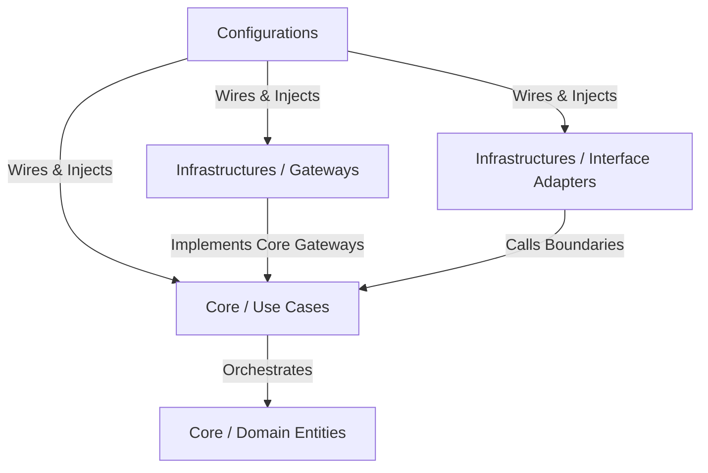

# Architectural Layout & Domain-Driven Design (DDD)

The `logger` project strictly enforces **Hexagonal Architecture (Ports and Adapters)** combined with **Domain-Driven Design (DDD)** concepts. This isolates business logic from databases, protocols, frameworks, and system execution details.

## 1. Directory Structure

Crates inside the workspace must align with the following architectural layers:



- **`core/domain`** (The Core Layer - Domain Entities): 
  - Pure business domain models, value objects, domain events, and domain-level validation rules.
  - Zero external dependencies on infrastructure libraries or databases.
- **`core/use-cases`** (The Core Layer - Use Cases): 
  - Application business logic and orchestration.
  - Divided into **boundaries** (traits acting as input/output ports with pure DTOs), **interactors** (use-case implementations orchestrating the dance of entities), and **gateways** (abstract infrastructural interfaces).
- **`infrastructures`** or **`gateways-impl`** (The Infrastructures Layer - Gateways): 
  - Adapter implementations of core gateway ports (e.g. SurrealDB/PostgreSQL repositories, Redis-based locks, message queue consumers).
- **`bindings`** (The Infrastructures Layer - Interface Adapters): 
  - Execution targets exposing the boundary interactors to runtime hosts (e.g., CLI binaries, WASM bindings, or web servers), including controllers and presenters.
- **`configurations`** or **`main`** (The Configurations Layer):
  - The highest-level wiring and lowest-level policy layer. A centralized Main component that gathers resources, injects dependencies into interactors, and hands control over to the bindings.

---

## 2. Domain-Driven Design (DDD) Conventions

### 2.1 Entities & Aggregates
- Entities must contain a unique identifier field.
- Aggregate roots coordinate operations within transaction boundaries.
- Entity fields should be private or selectively mutable only via domain methods that enforce invariance rules.

### 2.2 Value Objects (Newtype Pattern)
Identify and encapsulate distinct domain-specific data types (e.g., `LogMessage`, `AppKey`, `TraceId`) using single-field tuple structs.
- Use `::std::ops::Deref` to target the inner types directly.
- Implement `::core::convert::From` (or `TryFrom`) to wrap/unwrap values easily.
- Normalize and validate values in the constructor to keep value objects invariant.

*Example value object structure:*
```rust
#[derive(::core::fmt::Debug)]
#[derive(::core::clone::Clone)]
pub struct AppKey(::axiom::string::String);

impl ::std::ops::Deref for AppKey {
    type Target = ::axiom::string::String;
    
    fn deref(&self) -> &Self::Target {
        &self.0
    }
}
```

---

## 3. Boundaries and Interactors

### 3.1 Boundaries (Input/Output Ports)
- Define a request model struct, a response model type, and a boundary trait for each use-case.
- Boundary traits are asynchronous and receive `self` as a shared pointer to support thread-safe dependency injection:
  ```rust
  #[::async_trait::async_trait]
  pub trait IngestLogBoundary {
      async fn apply(
          self: ::std::sync::Arc<Self>, request: IngestLogRequest,
      ) -> ::axiom::result::Fallible<IngestLogResponse>;
  }
  ```

### 3.2 Interactors
- Interactors implement boundary traits and coordinate aggregates, repositories, and gateways.
- All interactor dependencies (e.g. `UserRepository`, `AlertQueue`) are defined as interface traits (gateways) and injected via shared pointers (`::std::sync::Arc<GatewayImpl>`). Do not use `dyn Gateway`; rather, monomorphize `GatewayImpl` as the Interactor's type parameter with bounds `GatewayImpl: Gateway + ::core::marker::Send + ::core::marker::Sync + 'static`.
