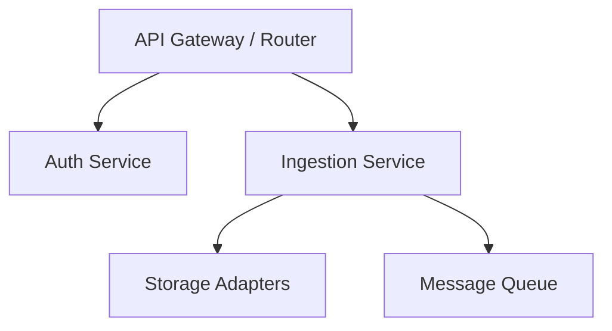

# Architectural Layout & Service-Oriented Architecture (SoA)

The `logger` project utilizes a **Concrete Service-Oriented Architecture (SoA)** approach. While we draw inspiration from clean boundaries, using pure Clean Architecture leads to the omission of implementation-specific details that the current system heavily depends on. Instead of rigid global layers, we organize around concrete services, preferring local abstractions within those services.

## 1. Directory Structure

Crates inside the workspace must align with service boundaries:

- **Services**: Grouped by bounded contexts (e.g., `ingestion-service`, `alert-service`).
- **Local Abstractions**: Abstracting dependencies (like traits and higher-ranked trait bounds) is preferred *locally* within a service to facilitate testing, rather than enforcing sweeping, global, pure-domain trait boundaries.
- **Implementation-Specific Details**: We embrace the fact that our services depend heavily on technologies like Redpanda or ClickHouse. Do not hide these completely behind leaky abstractions if doing so removes leverage over their specific features.

## 2. Performance and Data Ownership Conventions

To balance maximal performance with multi-core scalability, we adhere to pragmatic performance rules (ADR-0024).

### 2.1 Smart Pointers & Concurrency
- **Default to `Arc` for Shared State**: In a Tokio async ecosystem, shared dependencies must be `Send + Sync` to utilize multi-core work-stealing. Therefore, `::std::sync::Arc` is the default for shared architectural dependencies. 
- **Restrict `Rc`**: Only use `::std::rc::Rc` when atomic synchronization is strictly unnecessary AND the data will absolutely not cross an async `.await` boundary that requires `Send` (e.g., purely synchronous local parsing algorithms).

### 2.2 Avoiding Allocations (Cow & Borrowing)
- **Targeted `Cow`**: Use `::std::borrow::Cow` for hot-path payload parsing boundaries where zero-copy is critical. For general domain entities, default to owned data (`String`, `Vec`) to avoid lifetime contagion and branch-prediction overhead.
- **Pragmatic Cloning**: While unnecessary cloning should be avoided, explicitly clone small data structures if it avoids complex generic lifetimes or heap allocations.

## 3. Local Boundaries and Traits

### 3.1 Local Traits
- Define boundary traits (e.g., `LogRepository`) alongside the service that needs them.
- Avoid dynamic dispatch (`dyn Trait`) unless heterogeneous collections are required. Prefer monomorphization via generics and higher-ranked trait bounds (HRTB) locally within the service implementation.
