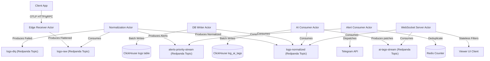
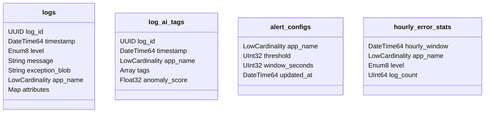

# Feature Specification: Log Collection and Application Error Monitoring System (Hardened Design)

**Feature Branch**: `03-hardened-v1`

**Created**: 2026-06-22

**Status**: Draft

**Input**: User description: "Disambiguated requirements in specs/02-disambiguated/README.md, guidelines in guidelines, output to specs/03-hardened/"

## Table of Contents
- [User Scenarios \& Testing](#user-scenarios--testing-mandatory)
  - [User Story 1 - Real-Time Log Streaming with RBAC](#user-story-1---real-time-log-streaming-with-rbac-priority-p1)
  - [User Story 2 - High-Speed Safe Ingestion and Schema Guarding](#user-story-2---high-speed-safe-ingestion-and-schema-guarding-priority-p1)
  - [User Story 3 - Asynchronous AI Classification and Sidecar Storage](#user-story-3---asynchronous-ai-classification-and-sidecar-storage-priority-p2)
  - [User Story 4 - Tumbling Window Alert Notification and Rate Limiting](#user-story-4---tumbling-window-alert-notification-and-rate-limiting-priority-p2)
  - [Edge Cases](#edge-cases)
- [Requirements](#requirements-mandatory)
  - [Functional Requirements](#functional-requirements)
  - [Logical Data Models \& Schemas](#logical-data-models--schemas)
  - [The Topic Topology (Event Boundaries)](#the-topic-topology-event-boundaries)
  - [Database Table Contracts](#database-table-contracts)
  - [Error Routing \& DLQ Contracts](#error-routing--dlq-contracts)
  - [Authorization Contracts](#authorization-contracts)
  - [Key Entities](#key-entities)
- [Governance \& Security Evidence](#governance--security-evidence-mandatory)
  - [Agent Parity Governance](#agent-parity-governance)
  - [Architecture Governance](#architecture-governance)
  - [Security Governance](#security-governance)
- [Success Criteria](#success-criteria-mandatory)
  - [Measurable Outcomes](#measurable-outcomes)
- [Assumptions](#assumptions)

---

## User Scenarios & Testing *(mandatory)*

### User Story 1 - Real-Time Log Streaming with RBAC (Priority: P1)

Authorized engineers MUST be able to open the Viewer dashboard and view a real-time stream of incoming normalized log records filtered by their permitted applications, without introducing database query load.

* **Why this priority**: Real-time observability is the primary mechanism for engineers to diagnose active issues in production. Securing log streams statelessly is critical to protect privacy and prevent scaling bottlenecks.
* **Independent Test**: Connect a mock WebSocket client with a JWT containing `app_grants: ["payment-api"]`. Ingest logs for both `payment-api` and `auth-service` into the pipeline. Verify that the WebSocket client receives only `payment-api` logs, and that the database receives zero read queries during this test.
* **Acceptance Scenarios**:
  1. **Given** a client requests a WebSocket connection passing a cryptographically valid JWT in the handshake containing `app_grants: ["payment-api", "user-service"]`, **When** logs for `payment-api`, `user-service`, and `order-service` flow through `logs-normalized`, **Then** the client MUST receive logs only for `payment-api` and `user-service` in real-time.
  2. **Given** a client requests a WebSocket connection with a JWT containing `app_grants: ["*"]` (wildcard), **When** logs for any application flow through `logs-normalized`, **Then** the client MUST receive all logs.
  3. **Given** a client requests a WebSocket connection with an expired or invalid token signature, **When** the handshake occurs, **Then** the server MUST reject the connection with a HTTP `401 Unauthorized` equivalent response.

---

### User Story 2 - High-Speed Safe Ingestion and Schema Guarding (Priority: P1)

The system MUST ingest log payloads at high-speed from external applications, flatten attributes mechanically at the edge, and enforce strict safety validation boundaries in the Normalization worker before database insertion to prevent database failure.

* **Why this priority**: Database protection is vital to prevent denial-of-service or memory crashes under malformed telemetry input. Flattening OTLP attributes ensures that query processing speeds remain high.
* **Independent Test**: Expose the Edge API receiver, submit valid OTLP payloads, recursive payloads (depth > 5), mixed-type arrays, and large payloads (>64KB). Verify that valid payloads are successfully indexed in ClickHouse, while malformed payloads are rejected or routed to the DLQ.
* **Acceptance Scenarios**:
  1. **Given** a valid OTLP JSON payload with nested key-value arrays, **When** it hits the Edge Receiver, **Then** it MUST be mechanically unrolled into dot-notation strings and successfully published to `logs-raw`.
  2. **Given** a log payload containing dynamic attributes with a nesting depth of 6 or higher (derived from dot-notation path length), **When** the Normalization Worker processes it, **Then** the message MUST be identified as a "Poison Pill", wrapped with error metadata, and routed to `logs-dlq` within 500ms.
  3. **Given** a log payload containing dynamic attributes with mixed data types in an array (e.g. `[42, "string", true]`), **When** the Normalization Worker processes it, **Then** the worker MUST route it to `logs-dlq` and keep processing subsequent logs.

---

### User Story 3 - Asynchronous AI Classification and Sidecar Storage (Priority: P2)

The system MUST asynchronously classify incoming normalized logs using machine learning models without blocking the primary ingestion pipeline, and store tags in a decoupled sidecar table.

* **Why this priority**: Enhances log metadata with anomaly scores and categories without degrading high-throughput ingestion latency.
* **Independent Test**: Ingest logs through the system. Observe the AI consumer pick up normalized logs from `logs-normalized`, execute local ONNX inference, write tags to the `log_ai_tags` sidecar table, and emit real-time updates.
* **Acceptance Scenarios**:
  1. **Given** a log payload is successfully published to `logs-normalized`, **When** the AI Consumer is running, **Then** the consumer MUST extract the message body, run its ONNX model, write the output tag and anomaly score to `log_ai_tags`, and publish a patch to `ai-tags-stream`.
  2. **Given** the AI inference latency spikes to 500ms per message under CPU/GPU load, **When** logs are ingested at 500 logs/second, **Then** the primary DB Writer MUST NOT experience lag, and only the AI metadata updates will experience lag.

---

### User Story 4 - Tumbling Window Alert Notification and Rate Limiting (Priority: P2)

The system MUST aggregate high-priority errors in a tumbling window and notify administrators via Telegram, while preventing API rate limits from blocking alerts during system outages.

* **Why this priority**: Avoids alerting fatigue and prevents Telegram API bans, maintaining alerting capability when systems fail catastrophically.
* **Independent Test**: Route 120 matching error logs to `alerts-priority-stream` within a 60-second window. Verify that the Alert Consumer sends exactly one alert notification digest to Telegram, and that subsequent messages are throttled by the token bucket rate limiter.
* **Acceptance Scenarios**:
  1. **Given** a threshold configuration of 100 errors per 60 seconds, **When** 150 errors with matching fingerprints are consumed from `alerts-priority-stream`, **Then** the Alert Consumer MUST fire exactly 1 notification to Telegram.
  2. **Given** the token bucket rate limit is reached, **When** further high-priority alerts are triggered, **Then** the Alert Consumer MUST batch these alerts into a summary digest instead of sending individual messages.

---

### Edge Cases

- **Edge Receiver Unbounded Parsing Prevention**: The Edge Receiver MUST enforce a strict 1MB connection-level read limit before JSON/OTLP payload parsing to prevent OOM attacks or stack overflows.
- **Attributes Payload Capped Size**: Payloads exceeding 64KB compressed MUST be routed to the `logs-dlq` topic by the Normalization Worker. Extremely large stack traces or diagnostic blobs MUST be stored in the root-level `exception_blob` String column.
- **Redis Alert Deduplication Cardinality Limit**: The Alert Consumer MUST enforce a hard cap of 10,000 unique error fingerprints per 60-second tumbling window in Redis. If the cap is reached, further unique errors fall back to batch summaries without unique tracking to prevent Redis memory exhaustion.
- **Attributes Key Sanitization**: Keys containing dot notation (e.g. `{"http.status_code": 200}`) or brackets (e.g. `{"labels[env]": "prod"}`) MUST be sanitized (e.g. replacing `.` and `[]` with `_`) to prevent ClickHouse JSON traversal path resolution crashes.
- **Graceful Termination of Stream Consumers**: When a worker thread receives a termination signal (`SIGTERM`), it MUST stop polling Redpanda, finish processing current in-flight logs, flush batch inserts to ClickHouse, commit offsets, and exit within a 30-second window.
- **ClickHouse Write Outage**: If ClickHouse becomes temporarily unavailable, the DB Writer MUST retry batch inserts using exponential backoff up to a maximum duration, then halt consumption to trigger Redpanda consumer group alerts. It MUST NOT acknowledge messages during database outages.
- **Redis Crash**: If Redis crashes or experiences a network partition, the Alert Consumer MUST fall back to query the ClickHouse `alert_configs` configuration stream directly using `argMax` to reconstruct in-memory state.

---

## Requirements *(mandatory)*

### Functional Requirements

- **FR-001**: The Edge Receiver MUST accept gRPC OTLP and HTTP POST log payloads. It MUST execute *zero* business logic, mechanically unrolling OTLP nested `kvlists` into dot-notation strings, and proxy the **flattened** payloads directly to Redpanda's `logs-raw` topic [ADR-0010, ADR-0016].
- **FR-002**: Client SDKs MUST strip PII before transmission. The architecture explicitly acknowledges the residual risk that `logs-raw` may temporarily store unredacted data if a client SDK fails, mitigating this with a strict short retention limit (e.g., 24 hours) on the topic. As a server-side defense-in-depth measure, the Normalization Worker MUST execute regex-based PII redaction rules on the flattened payload before publishing to `logs-normalized`. Additionally, the Normalization Worker MUST validate structure (depth limit <= 5 by inspecting dot-notation length, homogenous arrays, size <= 64KB), sanitize keys, and publish validated logs to `logs-normalized` [ADR-0002, ADR-0005, ADR-0017].
- **FR-003**: The Normalization Worker MUST route logs with level `ERROR` or `CRITICAL` directly to `alerts-priority-stream` [ADR-0004].
- **FR-004**: If processing encounters a Poison Pill or a parsing failure, the worker MUST publish the wrapped error context to `logs-dlq` [ADR-0018].
- **FR-005**: The DB Writer MUST read from `logs-normalized` and write logs in batches to the ClickHouse `logs` table [ADR-0001].
- **FR-006**: The AI Consumer MUST asynchronously consume `logs-normalized`, perform ONNX metadata classification, write to the ClickHouse sidecar `log_ai_tags` table, and publish patches to `ai-tags-stream` [ADR-0008, ADR-0017, ADR-0019].
- **FR-007**: The WebSocket Server MUST use the Broadcast Consumer Pattern to scaling horizontally, parsing JWT `app_grants` claims to filter messages in-memory, without querying any database or cache on a per-message basis [ADR-0014, ADR-0025].
- **FR-008**: The Alert Consumer MUST consume from `alerts-priority-stream`, execute O(1) Redis deduplication over a 60-second tumbling window, and dispatch notifications to Telegram [ADR-0012, ADR-0022, ADR-0023].
- **FR-009**: ClickHouse MUST enforce log retention policies via native Table-level TTL rules managed by Infrastructure-as-Code [ADR-0007].
- **FR-010**: Admin configuration updates MUST be written to `alert_configs` ReplacingMergeTree table in ClickHouse and published via Redis Pub/Sub [ADR-0015].

---

### Logical Data Models & Schemas

#### Attributes Constraints Map

| Metric | Constraint | Consequence of Violation | Citation |
| :--- | :--- | :--- | :--- |
| **Max Depth** | 5 levels (derived from dot-notation key segments) | Message classified as Poison Pill -> DLQ | `[ADR-0005]` |
| **Data Types** | Homogenous Arrays | Message classified as Poison Pill -> DLQ | `[ADR-0005]` |
| **Payload Size** | 64KB compressed | Message classified as Poison Pill -> DLQ | `[ADR-0005]` |
| **Key Characters** | No dots (`.`) or brackets (`[]`) | Sanitized: replaced with underscores (`_`) | `[ADR-0005]` |

#### OTLP Attributes Flattening Rules

Raw nested OTLP arrays containing `AnyValue` key-value pairs MUST be mechanically unrolled by the Edge Receiver into dot-notation strings to preserve depth data for the Normalization Worker.

```yaml
# Incoming raw OTLP payload example structure (JSON Representation)
attributes:
  - key: "http.status"
    value:
      intValue: 200
  - key: "user"
    value:
      kvlistValue:
        values:
          - key: "labels"
            value:
              arrayValue:
                values:
                  - stringValue: "admin"
                  - stringValue: "beta-tester"

# Resulting mechanically unrolled dot-notation in logs-raw
attributes:
  "http.status": 200
  "user.labels": ["admin", "beta-tester"]
```

#### OpenAPI Spec: Edge Receiver API

```yaml
openapi: 3.0.0
info:
  title: Edge Receiver Ingestion API
  version: 1.0.0
  description: Lightweight ingestion entry point terminating OTLP traffic.
paths:
  /v1/logs:
    post:
      summary: Send logs to pipeline
      operationId: ingestLogs
      requestBody:
        required: true
        content:
          application/json:
            schema:
              $ref: '#/components/schemas/IngestedLog'
      responses:
        '202':
          description: Ingestion payload accepted and written to raw stream.
        '400':
          description: Malformed JSON payload or payload size exceeds limits.
        '500':
          description: Redpanda unavailability.
components:
  schemas:
    IngestedLog:
      type: object
      required:
        - timestamp
        - level
        - message
        - app_name
      properties:
        timestamp:
          type: string
          format: date-time
          description: Log event generation timestamp.
        level:
          type: string
          enum: [DEBUG, INFO, WARN, ERROR, CRITICAL]
        message:
          type: string
          description: Raw log message text.
        app_name:
          type: string
          description: Originating service/application name.
        attributes:
          type: array
          description: Raw OTLP transport nested KeyValue array payload.
          items:
            type: object
            properties:
              key:
                type: string
              value:
                type: object
```

---

### The Topic Topology (Event Boundaries)

All internal asynchronous communication is executed via Redpanda topics. The following nodes represent asynchronous actor threads running concurrently within a single Modular Monolith binary, **not** distributed microservices.



#### Event Topic Directory

| Topic Name | Message Format | Producer Actor | Consumer Actor(s) | Role |
| :--- | :--- | :--- | :--- | :--- |
| `logs-raw` | Redpanda Payload JSON | Edge Receiver | Normalization Worker | Holds raw incoming payloads (PII-scrubbed by client SDKs). |
| `logs-normalized` | Redpanda Payload JSON | Normalization Worker | DB Writer, AI Consumer, WebSocket Server | Holds strictly schema-guarded logs. |
| `alerts-priority-stream`| Redpanda Payload JSON | Normalization Worker | Alert Consumer | Holds isolated error/critical alerts. |
| `logs-dlq` | Redpanda Payload JSON | Normalization Worker | None (Ops Inspection) | Holds processing errors and poison pills. |
| `ai-tags-stream` | Redpanda Payload JSON | AI Consumer | WebSocket Server | Holds real-time ML-generated metadata patches. |

---

### Database Table Contracts

OLAP Storage is managed strictly via ClickHouse. 
**Real-time analytical `JOIN` queries across UUIDs are strictly forbidden.** The `log_ai_tags` and `logs` tables are physically segregated fact tables designed for independent querying.



#### 1. Primary Logs Table (`logs`)
* **Engine**: `MergeTree()`
* **Partition Key**: `toYYYYMM(timestamp)` (monthly partitioned)
* **Sorting Key (Primary Index)**: `(app_name, level, timestamp, log_id)`
* **TTL Policy**: Evict INFO logs older than 7 days, Evict DEBUG logs older than 30 days, Evict all other logs older than 90 days.
* **Schema Constraints**: Values in the `attributes` map MUST be serialized to JSON strings by the DB Writer (e.g. `["admin"]` becomes `"[ \"admin\" ]"`) before insertion to satisfy the ClickHouse `Map(String, String)` typing constraint.
* **Schema**:
```sql
CREATE TABLE default.logs
(
    log_id UUID,
    timestamp DateTime64(3, 'UTC'),
    level Enum8('DEBUG' = 1, 'INFO' = 2, 'WARN' = 3, 'ERROR' = 4, 'CRITICAL' = 5),
    message String,
    exception_blob String,
    app_name LowCardinality(String),
    attributes Map(String, String)
)
ENGINE = MergeTree()
PARTITION BY toYYYYMM(timestamp)
ORDER BY (app_name, level, timestamp, log_id)
TTL timestamp + INTERVAL 7 DAY,
    timestamp + INTERVAL 30 DAY,
    timestamp + INTERVAL 90 DAY;
```

#### 2. AI Metadata Sidecar Table (`log_ai_tags`)
* **Engine**: `MergeTree()` (Append-Only storage, absolutely no row-level updates)
* **Partition Key**: `toYYYYMM(timestamp)`
* **Sorting Key (Primary Index)**: `(app_name, timestamp, log_id)`
* **TTL Policy**: Evict tags older than 90 days.
* **Schema**:
```sql
CREATE TABLE default.log_ai_tags
(
    log_id UUID,
    timestamp DateTime64(3, 'UTC'),
    app_name LowCardinality(String),
    tags Array(String),
    anomaly_score Float32
)
ENGINE = MergeTree()
PARTITION BY toYYYYMM(timestamp)
ORDER BY (app_name, timestamp, log_id)
TTL timestamp + INTERVAL 90 DAY;
```

#### 3. Alert Configurations Table (`alert_configs`)
* **Engine**: `ReplacingMergeTree(updated_at)` (Keeps only the latest config per app)
* **Sorting Key (Primary Index)**: `(app_name)`
* **Schema**:
```sql
CREATE TABLE default.alert_configs
(
    app_name LowCardinality(String),
    threshold UInt32,
    window_seconds UInt32,
    updated_at DateTime64(3, 'UTC')
)
ENGINE = ReplacingMergeTree(updated_at)
ORDER BY (app_name);
```

#### 4. Pre-aggregated Error Stats Table (`hourly_error_stats`)
* **Engine**: `AggregatingMergeTree()` (Maintained via Materialized View `mv_hourly_error_stats` to shield the logs table from aggregations)
* **Sorting Key (Primary Index)**: `(hourly_window, app_name, level)`
* **Schema**:
```sql
CREATE TABLE default.hourly_error_stats
(
    hourly_window DateTime64(0, 'UTC'),
    app_name LowCardinality(String),
    level Enum8('DEBUG' = 1, 'INFO' = 2, 'WARN' = 3, 'ERROR' = 4, 'CRITICAL' = 5),
    log_count SimpleAggregateFunction(sum, UInt64)
)
ENGINE = AggregatingMergeTree()
ORDER BY (hourly_window, app_name, level);

CREATE MATERIALIZED VIEW default.mv_hourly_error_stats
TO default.hourly_error_stats
AS
SELECT
    toStartOfHour(timestamp) AS hourly_window,
    app_name,
    level,
    count() AS log_count
FROM default.logs
GROUP BY hourly_window, app_name, level;
```

---

### Error Routing & DLQ Contracts

#### Poison Pill Criteria
A payload is semantic poison if it satisfies any of:
1. Malformed JSON parser errors.
2. Nesting depth of `attributes` map exceeding 5 (measured by dot-notation segments).
3. Non-homogenous list types in `attributes` arrays.
4. Total compressed message footprint exceeding 64KB.

#### DLQ Message Envelope (Schema)
When a consumer encounters a processing failure, it MUST wrap the original payload in this envelope before publishing to `logs-dlq`:

```json
{
  "$schema": "http://json-schema.org/draft-07/schema#",
  "title": "DLQEnvelope",
  "type": "object",
  "required": [
    "failed_at",
    "error_reason",
    "error_type",
    "worker_id",
    "original_payload"
  ],
  "properties": {
    "failed_at": {
      "type": "string",
      "format": "date-time"
    },
    "error_reason": {
      "type": "string"
    },
    "error_type": {
      "type": "string",
      "enum": ["SchemaPolicyViolation", "ParsingError", "SystemError"]
    },
    "worker_id": {
      "type": "string"
    },
    "original_payload": {
      "type": ["object", "string"]
    }
  }
}
```

---

### Authorization Contracts

The WebSocket server MUST enforce stateless role-based access control (RBAC) utilizing JWT tokens.

* **JWT In-Memory Verification**: The token signature MUST be cryptographically verified using a shared key or public keys during the connection handshake.
* **In-Memory App Grants Filtering**: Permitted applications are extracted from the `app_grants` array. No database lookups are permitted.
- **Wildcard Rule**: If `app_grants` contains `*`, all stream logs are permitted.

#### JWT Payload Scheme

```yaml
# JWT Claims verification payload YAML representation
type: object
required:
  - sub
  - role
  - app_grants
  - exp
properties:
  sub:
    type: string
    description: Unique engineer user identity key
  role:
    type: string
    enum: [admin, engineer]
  app_grants:
    type: array
    items:
      type: string
    description: List of permitted app names. Supports ["*"] for admins.
  exp:
    type: integer
    description: Expiration epoch timestamp
```

---

### Key Entities

- **LogEntry**: The canonical normalized log message inside the system, containing metadata (timestamp, ID, application) and sanitized attributes.
- **PoisonPill**: A corrupted, oversized, or policy-violating payload that is quarantined to the Dead Letter Queue.
- **AITag**: Classification tags and anomaly score metadata generated asynchronously by the machine learning engine and stored in the sidecar table.
- **AlertConfig**: Dynamic operational parameters defining alert thresholds and sliding windows, loaded into memory at startup.

---

## Governance & Security Evidence *(mandatory)*

### Agent Parity Governance

- **Checkpoint**: Shared Agent Guidance compliance.
- **Status**: `N/A`
- **Rationale**: No updates to `.specify/memory/constitution.md` or workspace-level templates are needed. All code generation follows the existing SoA guidelines.
- **Maintained Surfaces**: Feature specification (`spec.md`, `03-hardened.md`).
- **Deviations**: None.

### Architecture Governance

- **Checkpoint**: Memory safety and trust boundaries.
- **Status**: `Pass`
- **Evidence/Rationale**:
  - The implementation language for all critical services is Rust (memory-safe) [ADR-0002].
  - Trust boundary identified: The Edge Receiver ingests public telemetry data and is decoupled from the internal stream.
  - Threat modeling applies to the WebSocket server JWT verification logic to prevent token forgery and unauthorized stream tails.
  - BSI C3A Cloud Autonomy: `N/A`. The components utilize cloud-agnostic open-source Redpanda and ClickHouse, enabling full deployment autonomy on bare metal or custom private clouds.

### Security Governance

- **Checkpoint**: Security compliance standards.
- **Status**: `Pass`
- **Evidence/Rationale**:
  - Language: Rust is memory-safe.
  - OWASP ASVS: Session/JWT management (Verification of claims in WebSocket handshake) aligns with ASVS V3 (Session Management) and V4 (Access Control).
  - SBOM & SLSA: Multi-call binary compilation [ADR-0013] requires automated SBOM creation (`cargo sbom`) and reproducible container build steps matching SLSA Level 2.
  - Security Artifacts: Added `docs/security/threat_model.md` as a planned task.

---

## Success Criteria *(mandatory)*

### Measurable Outcomes

- **SC-001**: 95% of ingested client logs MUST be normalized, validated, and safely stored in ClickHouse in under 1.0 second.
- **SC-002**: The WebSocket viewer server MUST fan out logs from `logs-normalized` topic to client browsers in under 50 milliseconds of event receipt.
- **SC-003**: The Edge Receiver ingestion layer MUST sustain a write throughput of 500+ logs per second under continuous load without losing telemetry.
- **SC-004**: Alert deduplication MUST decrease Telegram API call volume by at least 90% during cascading incident storms.
- **SC-005**: 100% of Poison Pills MUST be detected and successfully routed to `logs-dlq` within 500ms of worker consumption.

---

## Assumptions

- **A-001**: Network load balancers will distribute incoming client traffic evenly across multiple Edge Receiver instances.
- **A-002**: Client applications are responsible for obtaining valid JWT tokens from the Identity Provider prior to opening WebSocket sessions.
- **A-003**: ClickHouse clusters are provisioned with adequate storage disk allocation matching the defined retention period (90 days).
- **A-004**: Redis cache remains highly available; standard query fallbacks to ClickHouse configure cache recovery on cold restarts.
