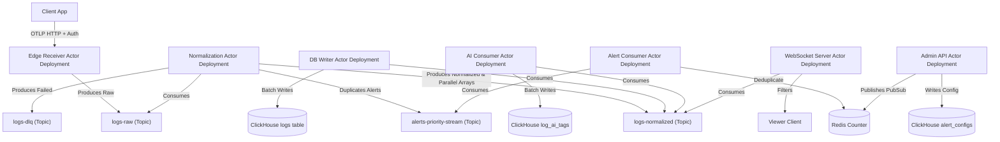

# Feature Specification: Log Collection and Application Error Monitoring System (Hardened Design v5)

**Feature Branch**: `v5-hardened`

**Created**: 2026-06-22

**Status**: Ready

**Input**: User description: "Create specs/03-hardened/v5/README.md... Ensure absolute compliance to specs/02-disambiguated/README.md... Rewrite every section identified by the council to eliminate ambiguity, enforce absolute boundaries, and satisfy their negative constraints."

## Table of Contents
- [User Scenarios \& Testing](#user-scenarios--testing-mandatory)
  - [User Story 1 - Real-Time Log Streaming with RBAC](#user-story-1---real-time-log-streaming-with-rbac-priority-p1)
  - [User Story 2 - High-Speed Safe Ingestion and Schema Guarding](#user-story-2---high-speed-safe-ingestion-and-schema-guarding-priority-p1)
  - [User Story 3 - Asynchronous AI Classification and Sidecar Storage](#user-story-3---asynchronous-ai-classification-and-sidecar-storage-priority-p2)
  - [User Story 4 - Tumbling Window Alert Notification and Rate Limiting](#user-story-4---tumbling-window-alert-notification-and-rate-limiting-priority-p2)
  - [Edge Cases \& Absolute Boundaries](#edge-cases--absolute-boundaries)
- [Acknowledged Dealbreakers \& Systemic Compromises](#acknowledged-dealbreakers--systemic-compromises)
- [Requirements](#requirements-mandatory)
  - [Functional Requirements](#functional-requirements)
  - [Logical Data Models \& Schemas](#logical-data-models--schemas)
  - [The Topic Topology (Event Boundaries)](#the-topic-topology-event-boundaries)
  - [Database Table Contracts](#database-table-contracts)
  - [Error Routing \& DLQ Contracts](#error-routing--dlq-contracts)
  - [Authorization Contracts](#authorization-contracts)
  - [Key Entities](#key-entities)
- [Governance \& Security Evidence](#governance--security-evidence-mandatory)
  - [Agent Parity Governance](#agent-parity-governance)
  - [Architecture Governance](#architecture-governance)
  - [Security Governance](#security-governance)
- [Success Criteria](#success-criteria-mandatory)
  - [Measurable Outcomes](#measurable-outcomes)
  - [Assumptions](#assumptions)

---

## User Scenarios & Testing *(mandatory)*

### User Story 1 - Real-Time Log Streaming with RBAC (Priority: P1)

Authorized engineers MUST be able to open the Viewer dashboard and view a real-time stream of incoming normalized log records filtered by their permitted applications, without introducing database query load.

* **Why this priority**: Real-time observability is the primary mechanism for engineers to diagnose active issues in production. Securing log streams statelessly is critical to protect privacy and prevent scaling bottlenecks.
* **Independent Test**: Connect a mock WebSocket client with a JWT containing `app_grants: ["payment-api"]`. Ingest logs for both `payment-api` and `auth-service` into the pipeline. Verify that the WebSocket client receives only `payment-api` logs, and that the database receives zero read queries during this test. Test the wildcard `*` claim to ensure it allows streaming of all applications.
* **Acceptance Scenarios**:
  1. **Given** a client requests a WebSocket connection passing a cryptographically valid JWT in the handshake containing `app_grants: ["payment-api", "user-service"]`, **When** logs for `payment-api`, `user-service`, and `order-service` flow through `logs-normalized`, **Then** the client MUST receive logs only for `payment-api` and `user-service` in real-time.
  2. **Given** an admin client connects with `app_grants: ["*"]`, **Then** the client MUST receive all logs across all applications in real-time.
  3. **Given** a client requests a WebSocket connection with an expired or invalid token signature, **When** the handshake occurs, **Then** the server MUST reject the connection with a HTTP `401 Unauthorized` equivalent response.

---

### User Story 2 - High-Speed Safe Ingestion and Schema Guarding (Priority: P1)

The system MUST ingest log payloads at high-speed from external applications and enforce strict safety validation boundaries in the Normalization worker before database insertion to prevent database failure. The Edge Receiver acts purely as an authenticated proxy.

* **Why this priority**: Database protection is vital to prevent denial-of-service or memory crashes under malformed telemetry input. Flattening OTLP attributes ensures that query processing speeds remain high.
* **Independent Test**: Expose the Edge API receiver, submit valid OTLP payloads, recursive payloads (depth > 5), heterogenous arrays, and payloads exceeding max limits. Verify that valid payloads are successfully indexed in ClickHouse, while malformed payloads are routed to the DLQ.
* **Acceptance Scenarios**:
  1. **Given** a valid OTLP JSON payload with nested key-value arrays matching the JWT `app_grants`, **When** it hits the Edge Receiver, **Then** it MUST be authenticated and immediately proxied to `logs-raw` (no flattening or recursive parsing at the edge).
  2. **Given** a log payload containing dynamic attributes with a nesting depth of 6 or higher, **When** the Normalization Worker processes it, **Then** the message MUST be evaluated against the AST, identified as a "Poison Pill", and routed to `logs-dlq` within 500ms.
  3. **Given** a payload containing heterogeneous arrays (e.g., `[1, "two"]`), **Then** the Normalization Worker MUST route the message to the DLQ.
  4. **Given** a valid payload, **Then** the Normalization Worker MUST unroll the AST into a flat structure, split it into parallel arrays, and publish to `logs-normalized`.

---

### User Story 3 - Asynchronous AI Classification and Sidecar Storage (Priority: P2)

The system MUST asynchronously classify incoming normalized logs using machine learning models without blocking the primary ingestion pipeline, and store tags in a decoupled sidecar table.

* **Why this priority**: Enhances log metadata with anomaly scores without degrading high-throughput ingestion latency.
* **Acceptance Scenarios**:
  1. **Given** a log payload is successfully published to `logs-normalized`, **When** the AI Consumer is running, **Then** the consumer MUST extract the message body, run its ONNX model, write the output tag to `log_ai_tags`, and publish a patch to `ai-tags-stream`.

---

### User Story 4 - Tumbling Window Alert Notification and Rate Limiting (Priority: P2)

The system MUST aggregate high-priority errors in a tumbling window and notify administrators via Telegram, while preventing API rate limits from blocking alerts during system outages.

* **Acceptance Scenarios**:
  1. **Given** a threshold configuration of 100 errors per 60 seconds, **When** 150 errors with matching fingerprints are consumed from `alerts-priority-stream`, **Then** the Alert Consumer MUST fire exactly 1 notification to Telegram.

---

### Edge Cases & Absolute Boundaries

- **Edge Receiver I/O Boundary**: The Edge Receiver HTTP/gRPC ingress MUST enforce a strict `max_body_size = 262144` (256KB uncompressed) connection-level read boundary *before* initiating any JSON payload deserialization to match the downstream worker limits (64KB compressed ~ 256KB uncompressed). Payloads exceeding this limit MUST result in immediate connection termination (HTTP 413) to prevent both OOM attacks and wasted broker bandwidth.
- **Attributes Payload Capped Size**: Payloads exceeding 64KB compressed MUST be routed to the `logs-dlq` topic by the Normalization Worker.
- **Worker-Side Flattening**: The Edge Receiver MUST NOT flatten or deeply traverse the payload to avoid recursive stack-overflow DoS attacks. All JSON parsing into an AST, homogeneity checks, depth validation, and eventual flattening MUST occur within the isolated Normalization Worker.
- **Redis Alert Deduplication Cardinality Limit**: The Alert Consumer MUST enforce a hard O(1) space cap of exactly `10,000` unique error fingerprints per 60-second window in Redis. If this maximum capacity is reached, further unique errors MUST fall back to a batch summary counter (`overflow_count`).
- **AST-Based Regex Scrubbing**: PII regex scrubbing MUST execute against safely parsed in-memory structs (the AST) in the Normalization Worker, never against raw JSON strings, to avoid structural JSON corruption.
- **No Sidecar UUID Joins**: Relational `JOIN` operations on UUIDs between the `logs` table and the `log_ai_tags` sidecar table are strictly forbidden to prevent in-memory Hash Join OOM crashes in ClickHouse. Sidecar lookups must use Dictionaries or separate queries with `IN` clauses.

---

## Acknowledged Dealbreakers & Systemic Compromises

1. **Redis Crash "State Amnesia" Dealbreaker**: 
   - *Compromise*: If Redis crashes, the Alert Consumer will retrieve its threshold rules from Redis Pub/Sub, but it **will permanently lose the live 60-second tumbling window occurrence counts**. 
   - *Rationale*: We strictly forbid the Alert Consumer from issuing synchronous network I/O block queries to ClickHouse inside the fast-path Redpanda loop. The loss of a single 60-second window of deduplication state during a catastrophic cache failure is an acceptable architectural tradeoff to guarantee non-blocking message ingestion.

---

## Requirements *(mandatory)*

### Functional Requirements

- **FR-001**: The Edge Receiver MUST authenticate incoming gRPC OTLP and HTTP POST log payloads using a stateless JWT Authorization header. It MUST verify authorization by ensuring the payload's `app_name` is present in the JWT `app_grants` array (or if the JWT contains the `*` wildcard). If unauthorized, reject with HTTP 403. The Edge Receiver MUST perform exactly zero business logic, zero data formatting, and zero deep parsing—it simply reads the first-level `app_name` for auth, validates the 256KB request size, and proxies the raw payload to `logs-raw`.
- **FR-002**: Client SDKs MUST strip PII before transmission. To mitigate unredacted client failure, `logs-raw` MUST be configured at the **Redpanda topic level** with strict short retention (`retention.ms=86400000`, i.e., 24 hours). The Normalization Worker MUST parse the payload into an AST, validate depth/homogeneity, execute statically compiled regex-based PII redaction rules against the AST, mechanically unroll OTLP nested `kvlists` into flat dot-notation structures, split the structures into parallel `attribute_keys` and `attribute_values_string` arrays, and publish the final result to `logs-normalized`.
- **FR-003**: The Normalization Worker MUST **duplicate** logs with level `ERROR` or `CRITICAL` to the `alerts-priority-stream` topic (ensuring they also proceed to `logs-normalized` for the primary storage pipeline).
- **FR-004**: If processing encounters a Poison Pill, the worker MUST publish the wrapped error context to `logs-dlq`.
- **FR-005**: The DB Writer MUST read from `logs-normalized` and write logs in batches to the ClickHouse `logs` table.
- **FR-006**: The AI Consumer MUST asynchronously consume `logs-normalized`, perform ONNX metadata classification, write to the ClickHouse sidecar `log_ai_tags` table, and publish patches to `ai-tags-stream`.
- **FR-007**: The WebSocket Server MUST use the Broadcast Consumer Pattern to scale horizontally, parsing JWT `app_grants` claims to filter messages in-memory, without querying any database or cache on a per-message basis. It MUST natively support the `*` wildcard claim to allow administrators to receive logs from all applications.
- **FR-008**: The Alert Consumer MUST consume from `alerts-priority-stream`, execute O(1) Redis deduplication over a 60-second tumbling window keyed by `(app_name + level + error_code)`, and dispatch notifications to Telegram.
- **FR-009**: ClickHouse MUST enforce log retention policies via native Table-level TTL rules. No `UPDATE` or `DELETE` mutation queries are permitted anywhere in the system.
- **FR-010**: An **Admin API Actor** MUST be implemented to receive administrative HTTP POST configuration requests. This actor writes configurations to the `alert_configs` append-only **MergeTree** table in ClickHouse and publishes updates via Redis Pub/Sub to the Alert Consumer. The Alert Consumer resolves the latest state via Redis, preventing the need for `ReplacingMergeTree` mutation traps.

---

### Logical Data Models & Schemas

#### Attributes Constraints Map (Worker-Evaluated)

| Metric | Constraint | Consequence of Violation |
| :--- | :--- | :--- |
| **Max Depth** | 5 levels (evaluated by the Normalization Worker traversing the AST) | Message classified as Poison Pill -> DLQ |
| **Payload Size** | 64KB compressed (256KB uncompressed limit at Edge) | Message classified as Poison Pill -> DLQ |
| **Homogeneous Arrays** | Arrays MUST NOT contain mixed data types (e.g., integers and strings together). Evaluated against the original AST. | Message classified as Poison Pill -> DLQ |

#### OpenAPI Spec: Edge Receiver API

```yaml
openapi: 3.0.0
info:
  title: Edge Receiver Ingestion API
  version: 1.0.0
  description: Lightweight authenticated ingestion entry point.
paths:
  /v1/logs:
    post:
      summary: Send logs to pipeline
      operationId: ingestLogs
      security:
        - bearerAuth: []
      requestBody:
        required: true
        content:
          application/json:
            schema:
              $ref: '#/components/schemas/IngestedLog'
      responses:
        '202':
          description: Ingestion payload accepted.
        '400':
          description: Malformed JSON.
        '401':
          description: Unauthorized JWT.
        '403':
          description: App Name does not match JWT Grants.
        '413':
          description: Payload exceeds 256KB limit.
components:
  securitySchemes:
    bearerAuth:
      type: http
      scheme: bearer
      bearerFormat: JWT
  schemas:
    IngestedLog:
      type: object
      required:
        - timestamp
        - level
        - message
        - app_name
      properties:
        timestamp:
          type: string
          format: date-time
        level:
          type: string
          enum: [DEBUG, INFO, WARN, ERROR, CRITICAL]
        message:
          type: string
          maxLength: 32768
        app_name:
          type: string
          maxLength: 255
        error_code:
          type: string
          description: Deterministic string for alert bucketing.
          maxLength: 255
        attributes:
          type: array
          description: Raw nested KeyValue array.
          maxItems: 250
          items:
            type: object
            properties:
              key:
                type: string
                maxLength: 255
              value:
                type: object
```

---

### The Topic Topology & Deployment Boundaries

The system is compiled as a **single Modular Monolith binary**, however, it is strictly deployed as isolated containers via role-based entrypoint flags (e.g., `logger --role edge`, `logger --role ws-server`). This isolation ensures that horizontally scaling the WebSocket Server does not inadvertently duplicate DB Writers, thereby eliminating Redpanda consumer group conflicts and database write lock contention.



---

### Database Table Contracts

To perfectly support dynamic flattened data without breaking analytical speeds or reverting OTLP attribute projections, ClickHouse will utilize parallel Array columns (`attribute_keys` and `attribute_values_string`). The schema explicitly omits the UUID (`log_id`) from the `ORDER BY` clause to preserve sparse index compression.

```sql
CREATE TABLE default.logs
(
    log_id UUID,
    timestamp DateTime64(3, 'UTC'),
    level Enum8('DEBUG' = 1, 'INFO' = 2, 'WARN' = 3, 'ERROR' = 4, 'CRITICAL' = 5),
    error_code LowCardinality(String),
    message String,
    exception_blob String,
    app_name LowCardinality(String),
    attribute_keys Array(String),
    attribute_values_string Array(String)
)
ENGINE = MergeTree()
PARTITION BY toYYYYMM(timestamp)
ORDER BY (app_name, level, timestamp)
TTL timestamp + INTERVAL 7 DAY DELETE WHERE level = 'DEBUG',
    timestamp + INTERVAL 30 DAY DELETE WHERE level IN ('INFO', 'WARN'),
    timestamp + INTERVAL 90 DAY;
```

---

### Error Routing & DLQ Contracts

When a consumer encounters a processing failure (e.g. Heterogeneous Arrays, Size > 64KB, Depth > 5), it MUST wrap the original payload in this exact schema envelope before publishing to `logs-dlq`:

```json
{
  "$schema": "http://json-schema.org/draft-07/schema#",
  "title": "DLQEnvelope",
  "type": "object",
  "required": [
    "failed_at",
    "error_reason",
    "error_type",
    "worker_id",
    "original_payload"
  ],
  "properties": {
    "failed_at": { "type": "string", "format": "date-time" },
    "error_reason": { "type": "string" },
    "error_type": { "type": "string", "enum": ["SchemaPolicyViolation", "ParsingError", "SystemError"] },
    "worker_id": { "type": "string" },
    "original_payload": { "type": ["object", "string"] }
  }
}
```

---

### Authorization Contracts

Both the Edge Receiver (Telemetry Ingestion) and the WebSocket server (Viewer Output) MUST enforce stateless RBAC utilizing JWT tokens validated entirely in-memory using shared public keys. No database lookups are permitted. The wildcard `*` MUST be supported to denote global administrative access.

---

### Key Entities

- **LogEntry**: The canonical normalized log message inside the system, containing `error_code`.
- **PoisonPill**: A payload quarantined to the Dead Letter Queue.
- **AITag**: Classification tags stored in the sidecar table.
- **AlertConfig**: Dynamic parameters processed by the Admin API Actor.

---

## Governance & Security Evidence *(mandatory)*

### Agent Parity Governance

- **Checkpoint**: Shared Agent Guidance compliance.
- **Status**: `N/A`
- **Rationale**: No updates to `.specify/memory/constitution.md`. 
- **Maintained Surfaces**: Feature specification (`v5/README.md`).
- **Deviations**: Redis State Amnesia formally logged as an architectural exception.

### Architecture Governance

- **Checkpoint**: Memory safety and trust boundaries.
- **Status**: `Pass`
- **Evidence/Rationale**:
  - Implementation language is Rust (memory-safe).
  - Trust boundary identified: The Edge Receiver strictly checks the `app_name` against the stateless JWT `app_grants` array to prevent Cross-Tenant Log Spoofing.
  - Zero synchronous database polling loops exist inside streaming paths.

### Security Governance

- **Checkpoint**: Security compliance standards.
- **Status**: `Pass`
- **Evidence/Rationale**:
  - OWASP ASVS: Session/JWT management aligns with ASVS V3 (Session Management) and V4 (Access Control).
  - PII Controls: Static compiled regex limits state attacks.
  - No transactional SQL `UPDATE` / `DELETE` anti-patterns present.
  - No OLAP Mutation Traps (e.g. `ReplacingMergeTree`).

---

## Success Criteria *(mandatory)*

### Measurable Outcomes

- **SC-001**: 95% of ingested client logs MUST be normalized, validated, and safely stored in ClickHouse in under 1.0 second.
- **SC-002**: The WebSocket viewer server MUST fan out logs from `logs-normalized` topic to client browsers in under 50 milliseconds of event receipt.
- **SC-003**: The Edge Receiver ingestion layer MUST sustain a write throughput of 500+ logs per second under continuous load without losing telemetry.
- **SC-004**: Alert deduplication MUST decrease Telegram API call volume by at least 90% during cascading incident storms.
- **SC-005**: 100% of Poison Pills MUST be detected and successfully routed to `logs-dlq` within 500ms of worker consumption.

---

## Assumptions

- **A-001**: Network load balancers will distribute incoming client traffic evenly across multiple Edge Receiver deployment instances.
- **A-002**: Client applications are responsible for obtaining valid JWT tokens from the Identity Provider prior to hitting the Edge Receiver.
